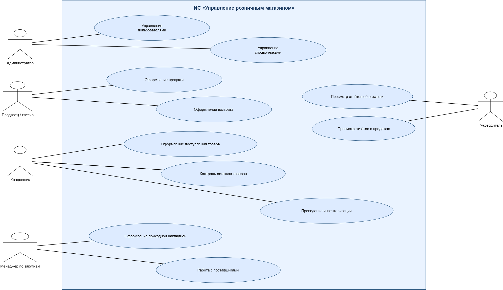

## Лабораторная работа №1 «ИС Управление розничным магазином»

### Основные бизнес-процессы информационной системы

- **Управление поступлением товара** — прием товаров от поставщиков, оформление поступления и отражение полученного количества в системе.
- **Управление продажами** — оформление покупки клиента, проведение оплаты, формирование чека и списание проданных товаров с остатка.
- **Управление возвратами** — оформление возврата товара клиентом, возврат денежных средств и отражение операции в системе.
- **Управление инвентаризацией** — проверка фактических остатков товаров и их сравнение с данными информационной системы, а также фиксация выявленных расхождений.

### Функциональные требования

1. Система должна вести справочник товаров (название, артикул, цена, штрихкод).
2. Система должна вести справочник поставщиков.
3. Система должна вести справочник клиентов.
4. Система должна оформлять приходные накладные от поставщиков.
5. Система должна вести учет остатков товаров на складе.
6. Система должна формировать чеки при продаже товаров.
7. Система должна рассчитывать сдачу и принимать оплату разными способами.
8. Система должна оформлять возвраты товаров.
9. Система должна формировать отчет по продажам за период (день, неделя, месяц).
10. Система должна формировать отчет по прибыли магазина.
11. Система должна автоматически предупреждать о снижении остатков товара ниже порогового значения.
12. Система должна формировать заказы поставщикам при дефиците товара.

### Сущности и атрибуты

| № | Сущность | Описание | Основные атрибуты |
|---|---|---|---|
| 1 | Товар | Товар, реализуемый магазином | Наименование, артикул, цена, штрихкод |
| 2 | Поставщик | Организация или лицо, поставляющее товары магазину | Наименование, ИНН, адрес, телефон, электронная почта |
| 3 | Клиент | Покупатель, приобретающий товары в магазине | ФИО, телефон, электронная почта, адрес |
| 4 | Сотрудник | Работник магазина, участвующий в оформлении и выполнении операций | ФИО, должность, телефон, электронная почта |
| 5 | Склад | Место хранения товаров | Наименование, адрес, ответственный сотрудник |
| 6 | Продажа | Операция реализации товара клиенту | Номер, дата, клиент, сотрудник, товар, количество, сумма |
| 7 | Возврат | Операция возврата ранее приобретённого товара | Номер, дата, клиент, сотрудник, товар, количество, причина возврата, сумма |
| 8 | Приходная накладная | Документ, фиксирующий поступление товаров от поставщика | Номер, дата, поставщик, склад, товар, количество, цена, сумма |
| 9 | Инвентаризация | Операция проверки фактического наличия и остатков товаров | Номер, дата, склад, ответственный сотрудник, товар, учётное количество, фактическое количество, разница |

### Акторы системы

| № | Актор | Описание |
|---|---|---|
| 1 | Администратор | Управляет пользователями, настройками и справочной информацией |
| 2 | Продавец / кассир | Работает с клиентами, оформляет продажи и возвраты |
| 3 | Кладовщик | Принимает товары, контролирует остатки и проводит инвентаризацию |
| 4 | Менеджер по закупкам | Работает с поставщиками и оформляет поступление товаров |
| 5 | Руководитель | Контролирует результаты работы и просматривает отчёты |
| 6 | Клиент | Приобретает и возвращает товары |

### Варианты использования

| № | Актор | Вариант использования |
|---|---|---|
| 1 | Администратор | Управление пользователями |
| 2 | Администратор | Управление справочниками |
| 3 | Продавец / кассир | Оформление продажи |
| 4 | Продавец / кассир | Оформление возврата |
| 5 | Кладовщик | Оформление поступления товара |
| 6 | Кладовщик | Контроль остатков товаров |
| 7 | Кладовщик | Проведение инвентаризации |
| 8 | Менеджер по закупкам | Работа с поставщиками |
| 9 | Менеджер по закупкам | Оформление приходной накладной |
| 10 | Руководитель | Просмотр отчётов о продажах |
| 11 | Руководитель | Просмотр отчётов об остатках |

## Диаграмма вариантов использования

### Спецификация варианта использования «Оформление продажи»

#### Актор
Продавец / кассир

#### Описание
Регистрация продажи товара клиенту с автоматическим расчётом суммы и изменением остатка товара на складе.

#### Основной поток

1. Продавец открывает форму продажи.
2. Выбирает клиента.
3. Выбирает товар.
4. Указывает количество.
5. Система проверяет наличие товара.
6. Система рассчитывает сумму.
7. Продавец подтверждает продажу.
8. Система сохраняет продажу.
9. Система уменьшает остаток товара.
10. Система сообщает об успешном завершении операции.

#### Альтернативные потоки

- Недостаточно товара на складе.
- Товар отсутствует в справочнике.
- Введены некорректные данные.

#### Предусловия

- Продавец авторизован в системе.
- Товар существует в справочнике.
- Товар доступен для продажи.

#### Постусловия

- Продажа сохранена.
- Остаток товара изменён.
- Итоговая сумма продажи рассчитана.

## Вывод по лабораторной работе

В ходе выполнения лабораторной работы №1 была рассмотрена информационная система управления розничным магазином.

Были определены основные бизнес-процессы магазина: поступление товаров, продажи, возвраты и инвентаризация. Также были сформулированы функциональные требования к системе, описаны основные сущности и их атрибуты, а также определены акторы и варианты использования информационной системы.

Для варианта использования «Оформление продажи» была составлена спецификация с описанием основного и альтернативных потоков, предусловий и постусловий.

В результате была разработана общая модель информационной системы розничного магазина и подготовлена диаграмма вариантов использования. Полученные материалы могут использоваться как основа для дальнейшего проектирования и разработки информационной системы.

## Контрольные вопросы
1. Бизнес процесс это набор структурированных действий для достижения конкретного результата, который необходим как ресурс для ведения бизнеса. 
Информационные системы с бизнес процессами взаимно связаны, ведь они помогают перевести задачи,действия которые участвуют в бизнес процессах в информационные системы для более качественной автоматизируемой работы
2. ФУНКЦИОНАЛЬНЫЕ ТРЕБОВАНИЯ - ЭТО ЧТО КОНКРЕТНО ДОЛЖНА ВЫПОЛНЯТЬ СИСТЕМА
   НЕФУНКЦИОНАЛЬНЫЕ ТРЕБОВАНИЯ - ЭТО КАКИМИ ХАРАКТЕРИСТИКАМИ ДОЛЖНА ОБЛАДАТЬ СИСТЕМА, КАК РАБОТАТЬ И КАКИЕ ОГРАНИЧЕНИЯ УЧИТЫВАТЬ
3. Это поведенческая диаграмма из унифицированного языка моделирования (UML). Она наглядно показывает, кто взаимодействует с системой (акторы) и какие функции (варианты использования) при этом доступны. 
Для чего она нужна:
  1. Помогает на ранних этапах собрать и согласовать требования между заказчиком, пользователями и командой разработки. 
  2. Чётко отделяет саму систему от её внешнего окружения. 
  3. Позволяет выявить основные сценарии работы и потенциальные сложности во взаимодействии. 
  4. Служит «мостиком» между бизнес-требованиями и технической реализацией: после неё уже можно углубляться в детали (проектировать архитектуру, писать код). 

4. Актор — это внешняя сущность, которая взаимодействует с системой. Это не обязательно человек: актором может быть другая программная система, аппаратное устройство, внешний сервис или даже фактор вроде времени или температуры. На диаграмме актора обычно изображают схематичным «человечком» либо символом класса со стереотипом. 

Как выявить акторов?
1. Провести интервью с заказчиками и конечными пользователями. 
2. Проанализировать бизнес-процессы: кто в них участвует и с какими задачами подходит к системе. 
3. Изучить существующие решения или аналоги: какие роли и внешние системы в них задействованы. 
4. Задать вопрос: «Кто или что использует эту систему и для какой цели?». 
Важно: актор всегда находится за пределами системы — он не является её внутренней частью. 

5. Спецификация раскрывает детали, которые диаграмма показывает слишком обобщённо. В ней обычно фиксируют:
1. Идентификатор и название варианта использования.
2. Вовлечённые акторы (кто инициирует взаимодействие).
3. Краткое описание цели
4. Связанные варианты использования (например, отношения «включает» или «расширяет»). 
5. Предусловия (что должно быть выполнено до начала сценария).
6. Основной поток событий (успешный сценарий).
7. Альтернативные потоки (другие допустимые варианты развития).
8. Исключительные сценарии (ошибки и ситуации, когда цель не достигается полностью).
9. Постусловия (что должно быть истинно после успешного завершения).
10. Минимальные гарантии (что сохраняется даже при неуспехе).
11. Связанные требования и бизнес-правила. 

6.Потому что именно на этом этапе закладывается фундамент всего проекта. Задача анализа — перевести размытые пожелания заказчика и пользователей в чёткие, измеримые и проверяемые требования. От того, насколько точно это сделано, зависит успех всего жизненного цикла. 
Почему это критично:
1. Если требования собраны неполно, противоречивы или неверно поняты, это почти гарантированно приведёт к тому, что итоговый продукт не удовлетворит пользователей. 
2. Ошибки на этапе анализа обходятся дороже всего: исправлять их на поздних стадиях (после написания кода или даже после релиза) значительно сложнее и затратнее. 
3. Качественный анализ помогает избежать лишних работ, правильно расставить приоритеты, выявить риски и ограничения ещё до начала проектирования и разработки. 
4. Результатом становится документ (например, SRS — Software Requirements Specification), который служит единой точкой отсчёта для всех участков
